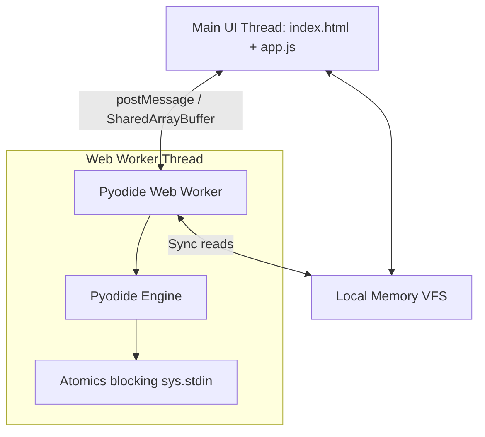

# BaiTapPyMi Architecture & Knowledge Base

This document details the architectural patterns, security configurations, thread synchronizations, and testing design implemented for the browser-based, client-side Python TUI workspace.

---

## 1. Multi-Threaded Execution Model

To avoid freezing the browser interface during heavy computations or synchronous input prompts, the application uses a multi-threaded web worker model:

- **Main Thread**: Manages the TUI DOM grid, inputs, file manager selection, code editors, and popups.
- **Web Worker**: Instantiates the Pyodide WebAssembly compiler and standard modules. It executes python scripts in isolation.

---

## 2. Synchronous Standard Input (`input()`) Interception

Python's `input()` function is blocking and synchronous. To support it in the asynchronous browser environment:
1. The main thread instantiates a `SharedArrayBuffer` (4096 bytes) and an `Int32Array` status buffer (2 indices).
2. The worker and UI thread share these buffers during initialization.
3. When `input()` is called, Pyodide triggers the worker's `stdin` hook:
   - Worker posts a `stdin_request` message to the UI thread.
   - Worker calls `Atomics.wait(sharedStatus, 0, 0)`. This suspends the worker thread safely.
4. The user types their input inside the terminal console input field in the browser.
5. When they hit `Enter`, the UI thread:
   - Encodes the text to UTF-8 bytes.
   - Writes the bytes into the `SharedArrayBuffer`.
   - Stores the text length in `sharedStatus[1]`.
   - Stores `1` in `sharedStatus[0]` (flagging input ready).
   - Calls `Atomics.notify(sharedStatus, 0, 1)` to wake the worker thread.
6. The worker wakes up, reads the text from the shared memory buffer, resets `sharedStatus[0] = 0`, and returns the input to Python.

### Safe Fallback Mode
If `SharedArrayBuffer` is blocked by browser configuration or missing secure headers:
- `app.js` catches the condition, logs a terminal warning, and configures the worker handshake without buffers.
- `pyodide.worker.js` skips buffer mappings, preventing a `RangeError`/`ReferenceError` crash and allowing normal execution (minus interactive inputs).

---

## 3. WebAssembly Virtual File System (VFS) Synchronization

Files created, edited, or deleted in the explorer must match the state inside Pyodide's internal WASM container (`MEMFS`) during module imports:
- **Write/Update**: Before executing a script, `app.js` passes the full workspace files dictionary. The worker creates parent folders if missing (`pyodide.FS.mkdir`) and writes the file (`pyodide.FS.writeFile`).
- **Deletions**: If a file is deleted from the UI, the worker scans Pyodide's current folder (`pyodide.FS.cwd()`) and unlinks (`pyodide.FS.unlink`) any `.py` or `.txt` file not present in the payload.
- **Security Check (Path Traversal)**: To prevent malicious filenames escaping the intended folder sandbox, filenames containing `..` or starting with `/` are explicitly skipped during synchronization.

---

## 4. Packaging Exercises & Diagnostic Assertions

The environment is designed to package challenge suites for users/students:
- **Skeleton Code**: Loaded into the `STATE.files` object in `app.js`.
- **Diagnostic Assertions**: Hidden test suites are defined in `HIDDEN_TESTS` in `app.js`.
- **Execution (F6)**:
  - When the user tests their script, the runner executes the user's implementation.
  - Next, it runs the corresponding python assertion script (e.g., verifying `solution.add(2, 3) == 5`).
  - If tests fail, Python raises an `AssertionError`.
  - The worker catches the exception, extracts the custom failure message, and sends it to the UI.
  - The UI displays outcomes safely using DOM `textContent` (neutralising XSS).

---

## 5. Hosting & Deployment Requirements

Because `SharedArrayBuffer` requires Spectre mitigation protections, modern browsers block it unless served under a Cross-Origin Isolated secure environment.

### Local Development
The custom development server (`server.py`) binds to `127.0.0.1` and injects:
- `Cross-Origin-Opener-Policy: same-origin` (COOP)
- `Cross-Origin-Embedder-Policy: require-corp` (COEP)
- `Cache-Control: no-store, no-cache, must-revalidate`

### Production & Static Hosting (GitHub Pages)
Since static hosts like GitHub Pages do not allow configuring server response headers directly, the project uses **Cross-Origin Isolation Service Worker (`coi-serviceworker.js`)**:
- It registers dynamically on page launch.
- Intercepts local file requests and injects the necessary COOP and COEP headers, enabling `SharedArrayBuffer` support on any static hosting environment.
- The workflow `.github/workflows/deploy.yml` triggers on pushes to the `main` branch to automatically publish the workspace to GitHub Pages.
